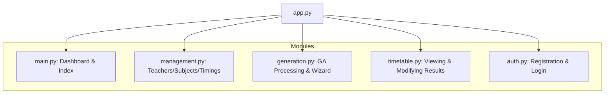

# 🏗️ Modular Backend Architecture

This document explains how the backend is split into specialized "Blueprints" to ensure clean code and easy maintenance.

## 🧱 Blueprint Deconstruction

The application is split into five functional modules:

## 🛠️ Module Breakdown

### 1. `Main Blueprint`
- **Dashboard**: Fetches dynamic stats from MySQL.
- **Index**: Handles the landing page.

### 2. `Management Blueprint`
- Handles all CRUD operations for institutional data.
- Connects **Teachers**, **Classes**, **Subjects**, and **Timings**.

### 3. `Generation Blueprint`
- The "Heavy Lifter".
- Interfaces with the `timetable_service.py` to trigger the Genetic Algorithm.
- Manages the session-based "Wizard" flow.

### 4. `Timetable Blueprint`
- Handles the complex visualization of the results.
- Provides endpoints for public viewing and admin-only modifications.

### 5. `Auth Blueprint`
- Manages the multi-tenant session security.
- Isolates data at the database query level using `school_id`.

## 📜 Standardized Patterns
- **Redirection**: All modules use `url_for('blueprint_name.function_name')` for robust routing.
- **Security**: Routes are protected by `@login_required`.
- **Logic Separation**: Heavy processing is always delegated to the `Service Layer`.

---
*By decoupling these features, we ensure that a change in the "Management" logic doesn't break the "Timetable Visualization" logic.*
