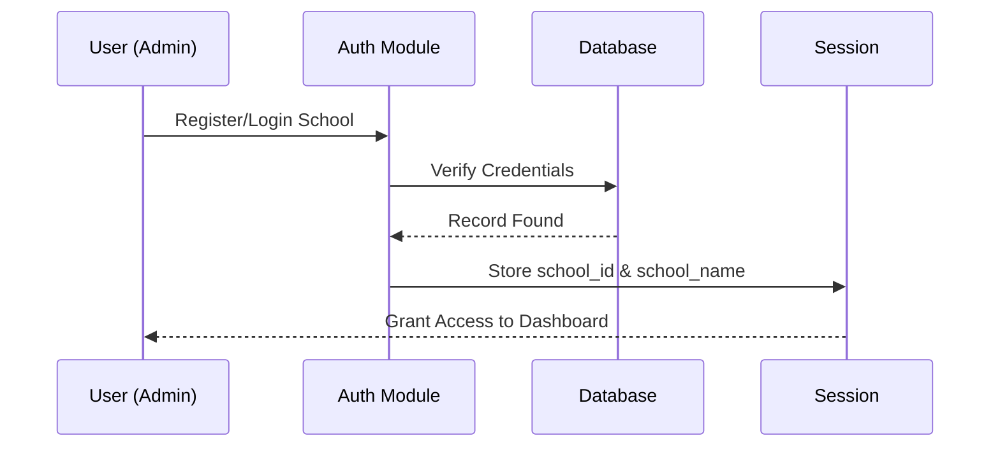

# 🔐 Authentication & Multi-Tenancy

Secure access for multiple schools on a single platform.

## 🏛️ System Design

Our application uses a "Multi-Tenant" approach, where each school has its own private workspace within the same database.

## 🛡️ Security Features

### 1. School Isolation
- Every table in our database includes a `school_id` column.
- All queries are filtered by `session['school_id']`.
- **Logic**: School A can *never* see teachers or timetables belonging to School B.

### 2. Login Required
- Protected routes are guarded by a custom `@login_required` decorator.
- If a session is lost, the user is immediately redirected to the login page.

### 3. Public Viewing
- Students can view their school's timetable using a "School Username" without needing a password.
- This creates a read-only public access point while keeping the "Modify" actions secure for admins.

---
*Important: Keep your admin credentials safe. The school_id is the primary key for all your data isolation.*
