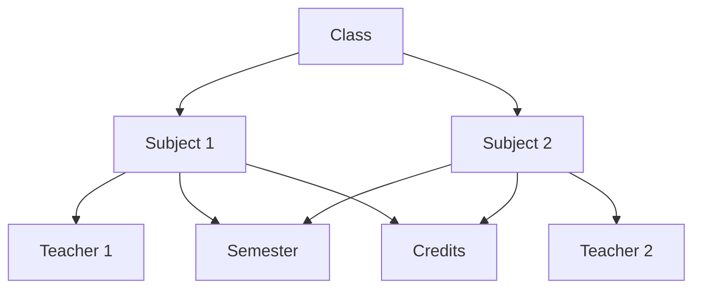

# 📚 Subject & Class Management

Efficiently organize your curriculum and classroom structure.

## 🏛️ Hierarchy

The data follows a simple hierarchy to ensure everything is linked correctly:

## 📂 Components

### 1. Classes
- Represent a specific group of students (e.g., "FE Computer A", "Class 10-B").
- Every subject belongs to exactly one class.

### 2. Subjects
- Each subject requires:
    - **Teacher**: Who will teach it?
    - **Semester**: Which term does it belong to?
    - **Credits**: How many lectures per week?
- **Credits Logic**: If a subject has 4 credits, the algorithm will ensure it appears exactly 4 times in the weekly schedule.

## ⚙️ How to Manage
1.  **Add Classes**: Use the dashboard to create your classrooms first.
2.  **Assign Subjects**: Link subjects to existing classes and teachers.
3.  **Set Semester**: Ensure you are assigning subjects to the correct term for generation.

---
*Important: You must have at least one teacher and one class before you can start adding subjects.*
