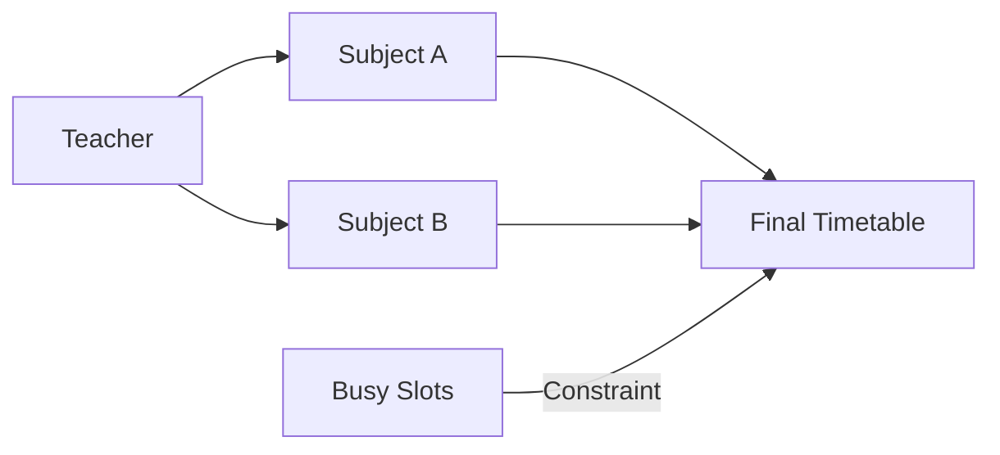

# 👨‍🏫 Teacher Management

This guide explains how to manage staff members and ensure their data is correctly integrated with the timetable generator.

## 📋 Overview

Teachers are at the core of the scheduling process. Each teacher is linked to subjects, and the algorithm ensures that their individual schedules never conflict across different classes.

## 🛠️ Actions

### 1. Adding a Teacher
 - Navigate to the **Staff Directory** page.
 - Enter the teacher's name.
 - The system will assign a unique ID to each staff member.

### 2. Automatic Conflict Resolution
When you add a teacher, the system automatically tracks:
- Which classes they are assigned to.
- Their specific time slots in the database.
- **Note**: When generating a new timetable, the engine checks all *other* generated timetables to ensure this teacher isn't already busy in another classroom at that specific time.

### 3. Deleting a Teacher
> [!WARNING]
> Deleting a teacher will also remove all subjects assigned to them. This is to maintain database integrity and prevent "dead" subjects with no instructors.

---
*Pro Tip: Ensure teacher names are unique and descriptive to avoid confusion during subject assignment.*
