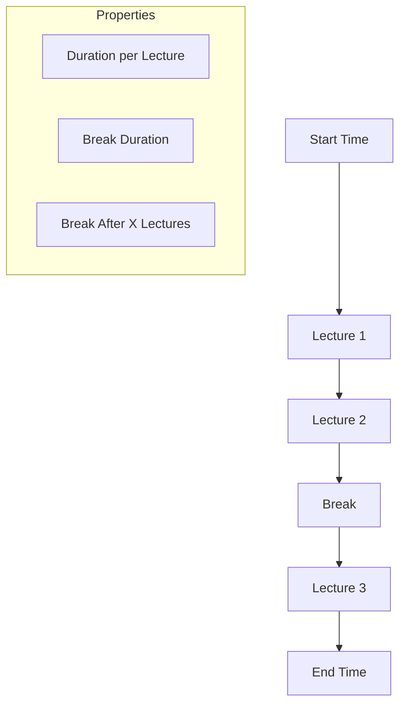

# 🕒 School Timing Management

Configure your institution's daily schedule with ease.

## ⚙️ Configuration Parameters

The system allows you to define a highly flexible time-space grid:

## 🛠️ How to Configure

### 1. Daily Hours
- Set your **Start Time** (e.g., 09:00 AM) and **End Time**.
- The generator will only place lectures within this window.

### 2. Lecture Duration
- Specify how many minutes each period lasts (e.g., 60 mins).
- This determines how many "Slots" are available in a day.

### 3. Break Structure
- **Break After**: Define the lecture number after which a break occurs (e.g., After 3rd lecture).
- **Break Duration**: How long the recess lasts.
- The algorithm automatically skips these slots to ensure no teacher or class is scheduled during the break.

---
*Pro Tip: Ensure your total duration (Start to End) is long enough to fit the required number of lectures plus the break!*
