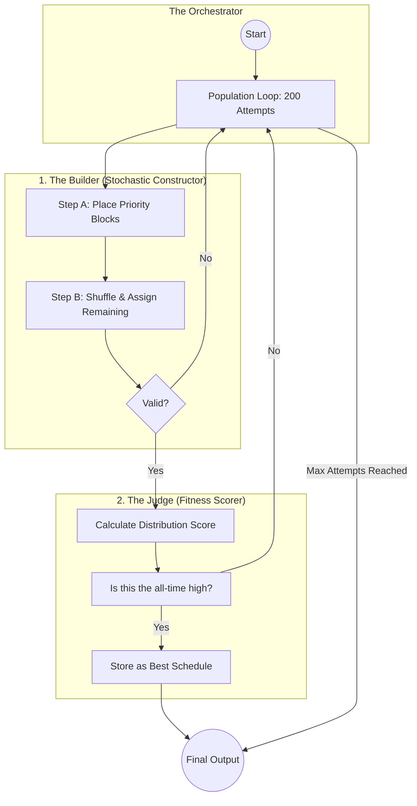
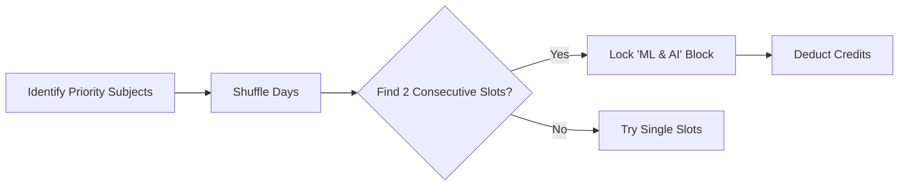
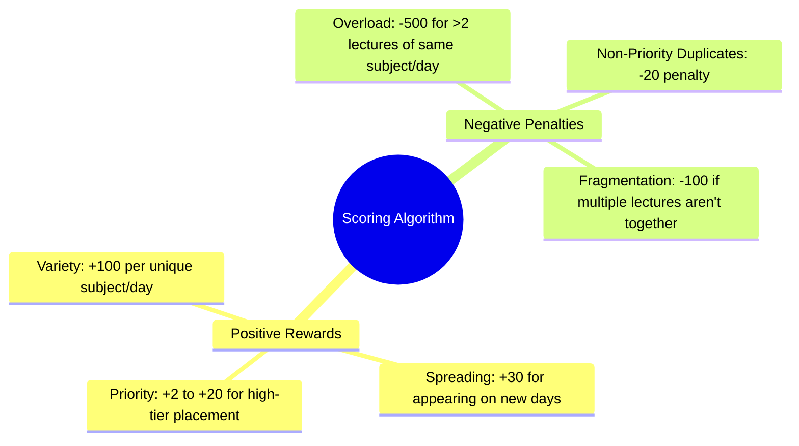

# 🧠 Genetic Algorithm Deep Dive: The Timetable "Brain"

This document provides a technical walkthrough of how the Timetable Generator solves the complex problem of scheduling classes without conflicts.

## 🏗️ High-Level Architecture: The Builder-Judge Pattern

The algorithm operates on a **Builder-Judge** pattern. It doesn't just "guess" a timetable; it tries hundreds of candidate versions and picks the absolute winner.

---

## 🧩 Deep Dive into Components

### 1. The Builder (Handling Hard Constraints)
The Builder's job is to create a schedule that obeys the laws of physics (no person can be in two places at once).

**Sub-Logic: High Priority Block Placement**
To ensure important subjects get good slots, we use a "Greedy First" strategy:

> [!NOTE]
> By placing the hardest constraints (consecutive high-priority slots) first, we significantly increase the chance of finding a successful schedule.

### 2. The Judge (Scoring for Human Usability)
A schedule might be "valid" but still terrible (e.g., 6 hours of Math in one day). The Judge uses a **Fitness Function** to reward or penalize schedules based on usability.

**The Scoring Sub-Diagram:**

### 3. Constraint Management
The algorithm maintains an `invalid_slots` map. This allows the Admin to say: *"Professor Divesh is busy on Monday mornings,"* and the algorithm will treat those slots as "forbidden territory" for that specific teacher.

---

## 📈 Evolution vs. Randomness
While we call it a "Genetic Algorithm," it specifically utilizes **Stochastic Optimization with Distributed Scoring**. 

1.  **Stochastic**: Uses randomness to explore millions of combinations.
2.  **Scoring**: Uses high-level mathematical weights to ensure the "Evolution" moves toward a human-friendly timetable.

🚀 **Result**: Within ~200 attempts, the algorithm typically finds a schedule that would satisfy both students and faculty perfectly.
