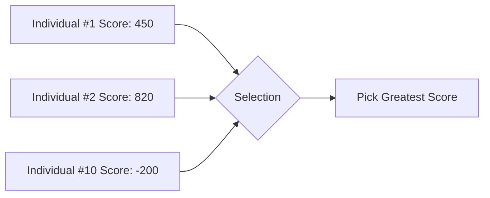
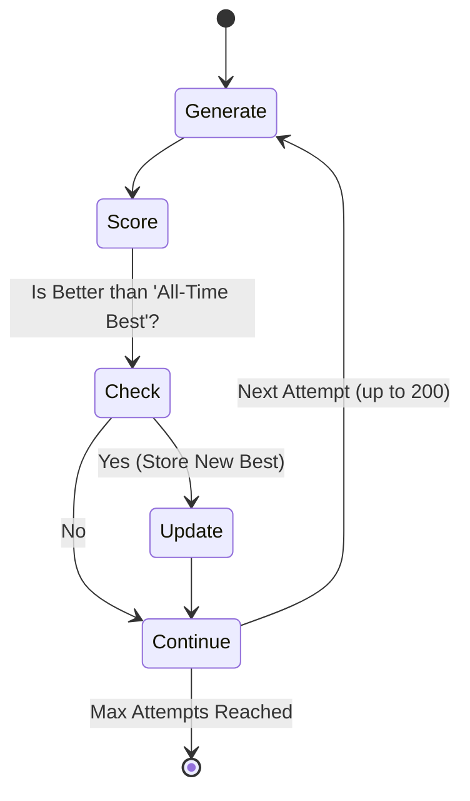

# 🎬 Timetable Generation: A Step-by-Step Demo

This guide walks you through a "live" demonstration of how our algorithm takes raw data and evolves it into a perfect schedule.

---

## 📅 Step 1: The Initial Ingredients
Before the "Brain" starts, we define our inputs. Let's look at a sample institucional setup:

**Teachers & Subjects:**
-   **Prof. Divesh**: Assigned to *Python Advanced* (3 Lectures/week).
-   **Prof. Groq**: Assigned to *SQL Mastery* (2 Lectures/week).

**The Schedule Skeleton:**
-   Total Slots: 10 (e.g., 2 slots/day for 5 days).
-   Constraint: Prof. Divesh is high priority.

---

## 🧬 Step 2: Generating the Initial Population
The algorithm starts by creating **200 different "Individuals"** (candidate timetables).

**Example: Individual #1 (Random Seed)**
| Day | Slot 1 | Slot 2 |
| :--- | :--- | :--- |
| **Mon** | Python | [Empty] |
| **Tue** | SQL | Python |
| **Wed** | SQL | Python |

> [!NOTE]
> At this stage, some individuals might be terrible! They might have teacher overlaps or break the "2 lectures per day" rule.

---

## ⚖️ Step 3: Survival of the Fittest (Selection)
Now, the **Judge** (Scoring Logic) examines every single individual.

**Why was Individual #2 the winner?**
-   It placed Python lectures consecutively (High Priority Bonus).
-   It didn't put more than 2 lectures on a single day (No Penalties).

---

## 🔄 Step 4: Iteration & Backtracking
If the algorithm reaches the end of an attempt and finds the score is still low, it **"Iterates Back"**.

1.  **Discard**: The weak schedules are thrown away.
2.  **Backtrack**: The algorithm goes back to Step 2 and tries a *different* random seed.
3.  **Refine**: It keeps the current "All-Time Best" and only replaces it if a new, even stronger candidate is found in the current loop.

---

## 🏆 The Final Result
After 200 iterations, the "Fittest" individual is returned to the user. What started as a messy pile of teachers and subjects has **evolved** into a conflict-free, optimized educational plan!

[<< Back to Technical Deep Dive](file:///c:/Users/djadh/Downloads/Timetable/documentation/algorithm_deep_dive.md)
