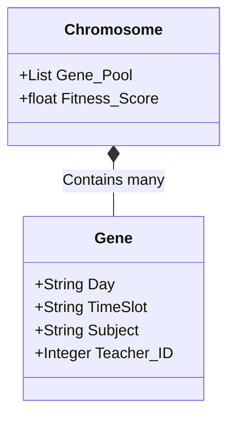
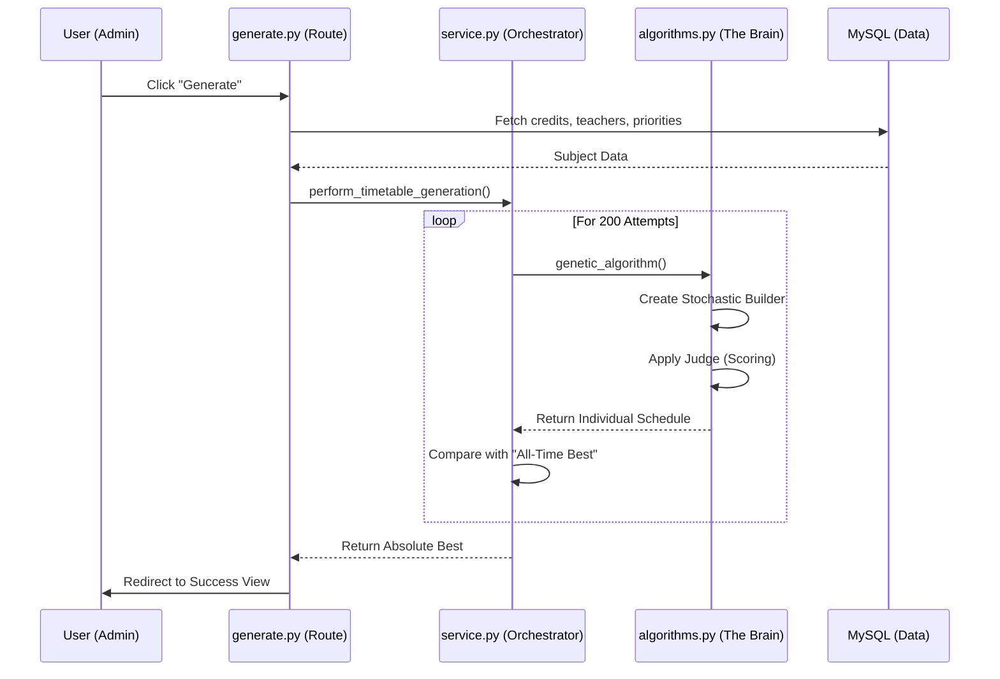

# 🎓 Algorithm Masterclass: The Science of Scheduling

This document serves as the "Pro-Level" guide to the Genetic-Stochastic algorithm powering our Timetable Generator. We will dive into the DNA structure, conflict matrices, and the complete system sequence.

---

## 🧬 1. The Chromosome Mapping (Digital DNA)

In our system, a **Timetable** is a **Chromosome**. Each **Entry** (Subject + Teacher) in a specific time-slot is a **Gene**.

**Representation in Memory:**
-   **Day/Time Mapping**: We convert days (Mon-Sat) and times (08:00, etc.) into a 2D coordinate system.
-   **Collision Check**: The algorithm checks if two Genes share the same coordinate (Day, Time) while having different Class IDs.

---

## 🛑 2. The Constraint Matrix

Not all rules are equal. We separate them into **Hard** (Survival) and **Soft** (Optimization) categories.

| Rule Type | Constraint | Consequence of Breach | Logic Level |
| :--- | :--- | :--- | :--- |
| **HARD** | Teacher Collision | **Invalidates Individual** | Physical |
| **HARD** | Class Collision | **Invalidates Individual** | Physical |
| **HARD** | Over-Credits | **Invalidates Individual** | Academic |
| **SOFT** | Subject Priority | **Lower Fitness Score** | UX/Quality |
| **SOFT** | Daily Variety | **Lower Fitness Score** | UX/Quality |
| **SOFT** | Fragmentation | **Lower Fitness Score** | UX/Quality |

---

## 🔄 3. The Generation Pipeline (Sequence Diagram)

This diagram shows the exact interaction between the **Service Layer**, the **GA Brain**, and the **Database**.

---

## 🧮 4. The "Backtracking" Logic

When the algorithm places a high-priority block (like a double-lecture) and later finds it cannot place the remaining subjects, it **Backtracks**.

**How it works:**
1.  **State Save**: It saves the state after priority placement.
2.  **Trial**: It tries to fill the rest randomly.
3.  **Reset**: If it hits a "Dead End" (no slots left for a subject), it **Resets** to the saved state and tries a different random path.

---

## 🎯 5. Conclusion: Why this works?

The problem of school scheduling is **NP-Hard**. A human would take hours because they can only try 1-2 versions at a time. This algorithm tries **200 versions in <2 seconds**, ensuring that the one you see is the most optimized version possible within that search space.

[<< Back to Demo Walkthrough](file:///c:/Users/djadh/Downloads/Timetable/documentation/algorithm_demo_walkthrough.md) | [<< Back to Deep Dive](file:///c:/Users/djadh/Downloads/Timetable/documentation/algorithm_deep_dive.md)
