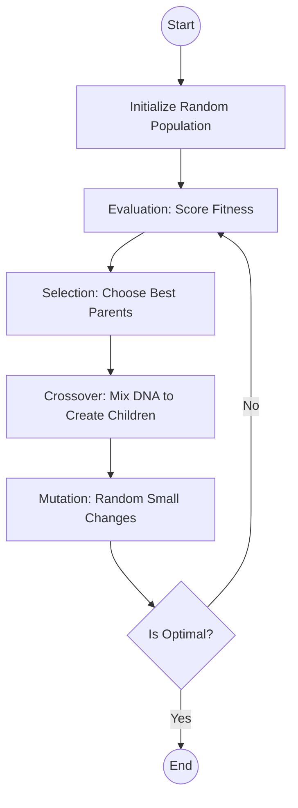

# 🧬 Genetic Algorithm Logic

This document explains the "Brain" of our application: the Genetic Algorithm (GA) used to generate optimized school timetables.

## ❓ What is a Genetic Algorithm?

A Genetic Algorithm is a search technique used in computing to find approximate solutions to optimization and search problems. It is inspired by **Charles Darwin’s theory of natural evolution**.

## 🔄 The Evolutionary Cycle

In our application, the algorithm follows these steps to find the best possible timetable:

## 📐 How it works in our App

### 1. The Chromosome (DNA)
Instead of genes, our "DNA" consists of **Time Slots** and **Subjects**. A single timetable is one "Individual" in the population.

### 2. Hard Constraints (Must follow)
These are rules that *cannot* be broken. If they are, the fitness score drops significantly:
- **No Teacher Overlaps**: A teacher cannot be in two classes at the same time.
- **No Class Overlaps**: A class cannot have two subjects at the same time.
- **Break Slots**: No lectures can be scheduled durante break times.

### 3. Soft Constraints (Should follow)
These are preferences that make the result better but aren't strictly required:
- **Priority**: High-priority subjects are pushed to earlier or more desirable slots.

### 4. Selection & Reproduction
- **Survival of the Fittest**: Timetables with fewer conflicts are selected to produce the next generation.
- **Crossover**: We take parts of two good timetables and combine them to create a new one.
- **Mutation**: We occasionally swap two random slots to prevent the algorithm from getting "stuck" in a sub-optimal solution.

## 🏆 Success Criteria
The algorithm stops when it finds a timetable with **Zero Hard Conflicts** or when it reaches a maximum number of generations.

---
*By simulating evolution, we can solve in seconds what would take a human hours to figure out manually.*
