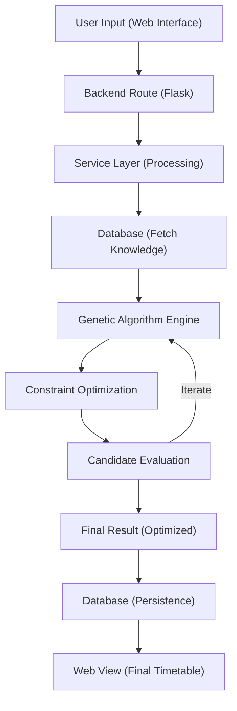

# 🚀 Complete Architecture Pipeline

This document explains how the Timetable Generator processes data from the initial request to a finalized, optimized schedule.

## 🏗️ High-Level Flow

The application follows a structured pipeline where user inputs are validated, processed by a genetic algorithm, and then stored/visualized.

## 🔍 Pipeline Stages

### 1. Data Collection
- The admin inputs raw data: **Teachers**, **Subjects**, **Classes**, and **School Timings**.
- This data forms the "Environment" in which the algorithm will operate.

### 2. Request Handling
- When the user clicks "Generate", the `generation.py` blueprint captures the request.
- It passes specific parameters (Class Name, Semester, Priorities) to the `timetable_service.py`.

### 3. Knowledge Retrieval
- The Service Layer queries the MySQL database to pull:
    - Teacher availability (busy slots from other classes).
    - Subject requirements (credits/lectures per week).
    - School configuration (start/end times, breaks).

### 4. Genetic Algorithm Engine
- **Initialization**: Creates a random population of timetable candidates.
- **Evaluation**: Each candidate is scored based on "Hard Constraints" (No teacher overlaps) and "Soft Constraints" (Priorities).
- **Evolution**: Through Crossover and Mutation, the candidates evolve to improve their fitness score.

### 5. Persistence & Delivery
- Once an optimal solution is found, it is saved back to the `timetable` table.
- The user is redirected to the `final_timetable.html` view, where the result is rendered in a beautiful, manageable grid.

---
*Note: This pipeline ensures that every generated timetable is technically valid and optimized for your specific institutional needs.*
