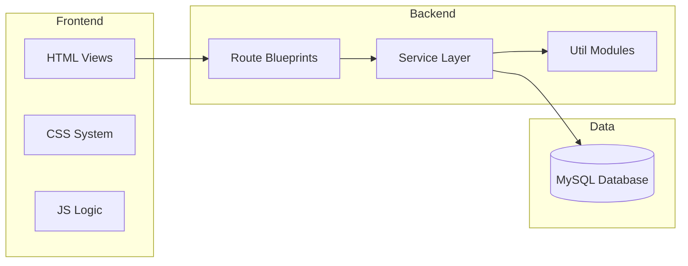

# 🛠️ Technology Stack

This project leverages a modern, modular stack designed for performance, maintainability, and a premium user experience.

## 🌐 Core Technologies

| Layer | Technology | Usage |
| :--- | :--- | :--- |
| **Backend** | Python / Flask | Modular blueprint-based web server. |
| **Frontend** | Vanilla HTML/CSS/JS | Custom-built "Fresh Midnight" design system. |
| **Database** | MySQL | Relational data persistence (Teachers, Subjects, Schedules). |
| **Logic** | Genetic Algorithm | Heuristic search for optimal timetable generation. |
| **Assets** | Mermaid.js | Dynamic, code-based architectural diagrams. |
| **Icons** | Font Awesome | Vector icons for intuitive navigation. |

## 🏗️ Architectural Pattern

The application follows a **Modular Layered Architecture**:

## 🎨 Design System
- **Layout**: Sidebar-driven responsive navigation.
- **UI Components**: Glassmorphism effects, custom badges, and interactive cards.
- **Typography**: `Inter` and `Outfit` Google Fonts for a premium look.

## 🧬 Algorithm Logic
The core engine uses a **Genetic Algorithm** written in pure Python. It simulates the process of natural selection to solve the complex NP-hard problem of scheduling multiple subjects into a limited time-space grid.

---
*By using Vanilla technologies wherever possible, we ensure zero bloat and maximum control over the user experience.*
