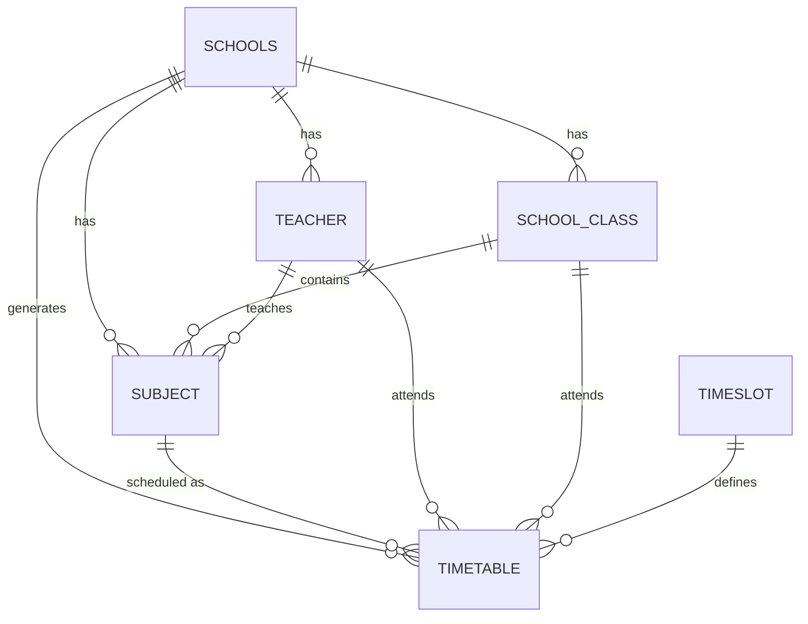

# 🗄️ Database Schema

A relational look at how the Timetable Generator stores your data.

## 🗺️ Entity Relationship (ER) Diagram

## 📖 Table Definitions

### 1. `schools`
- The root entity (Tenants).
- Stores configuration likes name, login details, and timing defaults.

### 2. `teacher`
- Linked to `school_id`.
- Primarily used for conflict checking (Teacher busy status).

### 3. `class`
- Represents a student group.
- The parent container for subjects.

### 4. `subject`
- The core unit of work.
- Links a `class`, a `teacher`, and `credits`.

### 5. `timetable`
- The output table.
- Stores the final (Day, Time, Subject, Teacher, Class) mapping.

---
*Note: All tables index the `school_id` to ensure high-performance filtering across multiple schools.*
