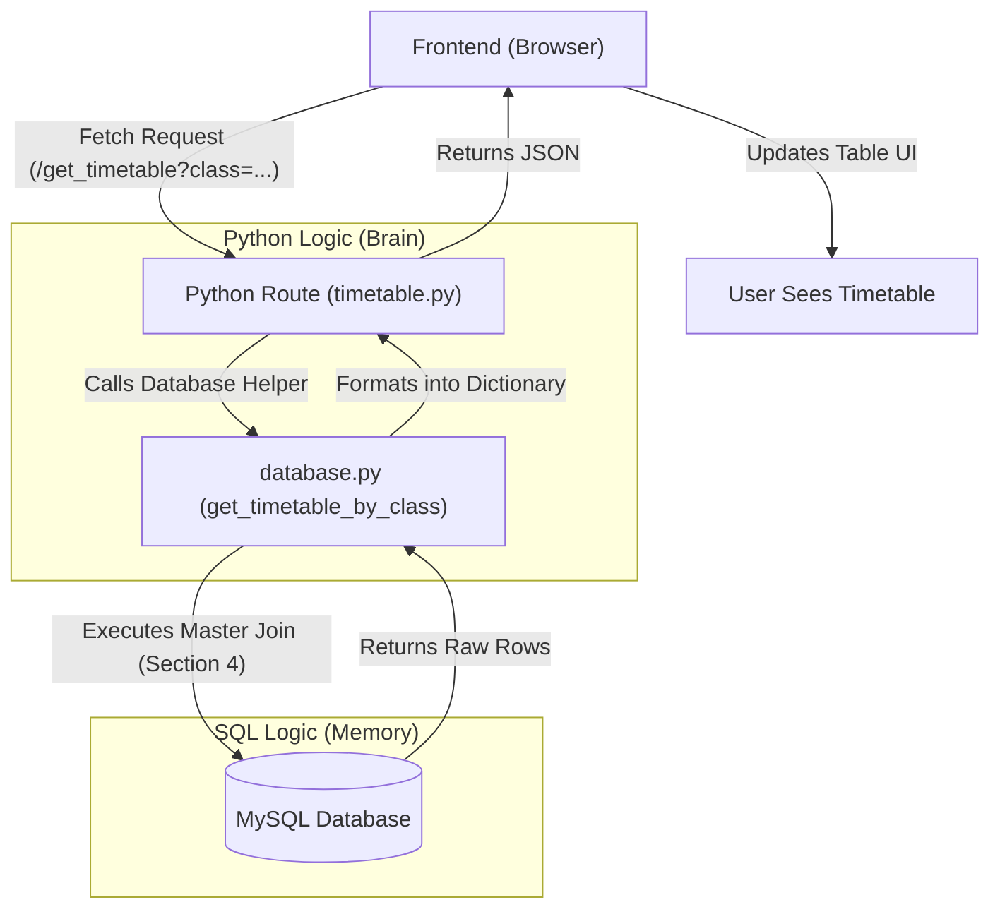

# ✅ Mission Debrief: The Results

Congratulations on completing the investigation! Here are the official findings of your logic-to-SQL hunt.

## 🏁 The Answer Key

| Discovery | Feature | SQL Pattern | Python File |
| :--- | :--- | :--- | :--- |
| **A** | Dashboard Stats | **Section 2** | `src/routes/main.py` |
| **B** | Master Join | **Section 4** | `src/database/database.py` |
| **C** | Dropdown APIs | **Section 5** | `src/routes/timetable.py` |
| **D** | Login Lookup | **1.1** | `src/auth/auth.py` |
| **E** | Add Teacher | **3.1** | `src/routes/management.py` |

---

## 📂 The Evidence (Deep Dive)

Here is exactly what you were looking for in the code:

### **Discovery A: Counting the Data**
In `main.py`, you found:
```python
cursor.execute("SELECT COUNT(*) FROM class WHERE school_id = %s", (school_id,))
```
This maps to **Section 2.1** in your SQL file. It's how we show the Admin their institution's size at a glance!

### **Discovery B: The Master Join**
In `database.py`, you found the massive string:
```python
query = """SELECT s.subject_name, t.day, ts.timeslot, tc.teacher_name ..."""
```
This maps to **Section 4**. This query is the heart of the app—it pulls data from 5 different tables simultaneously to build the timetable grid.

### **Discovery C: Populating Dropdowns**
In `timetable.py`, you found:
```python
cursor.execute("SELECT DISTINCT c.class_name FROM class c ...")
```
This maps to **Section 5.1**. We use this dynamic query so that students don't have to type their class name; they just select it from a list!

---

## 🛡️ The Challenge Answer: Why `school_id`?

You noticed that almost every query uses `WHERE school_id = %s`. 

**The Reason**: **Multi-Tenancy Security**. 
In a shared database, "School A" and "School B" live in the same tables. Without the `school_id` filter:
-   Admin A could see teachers from School B.
-   A student from High School X could accidentally download the schedule for University Y.
-   **Security Principle**: We must always isolate data so each user only sees what belongs to them.

---

## 📊 Visual System Flow



---

[<< Return to Mission Questions](file:///c:/Users/djadh/Downloads/Timetable/documentation/exercises/exercise_questions.md) | [Explore the Python-SQL Map](file:///c:/Users/djadh/Downloads/Timetable/documentation/sql_python_mapping.md)
